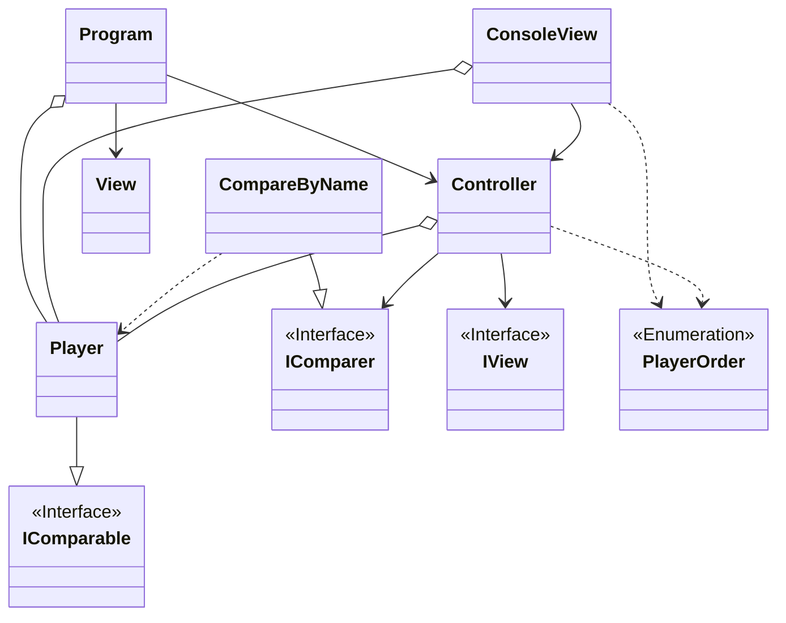

# UML

```mermaid
classDiagram
    Controller o-- Player
    Player --|> IComparable
    Controller --> IComparer
    CompareByName ..> Player
    CompareByName --|> IComparer
    Controller --> IView
    Controller ..> PlayerOrder
    ConsoleView o-- Player
    Program o-- Player
    ConsoleView --> Controller
    ConsoleView ..> PlayerOrder
    Program --> Controller
    Program --> View

    <<Interface>> IView
    <<Interface>> IComparer
    <<Interface>> IComparable
    <<Enumeration>> PlayerOrder

```
